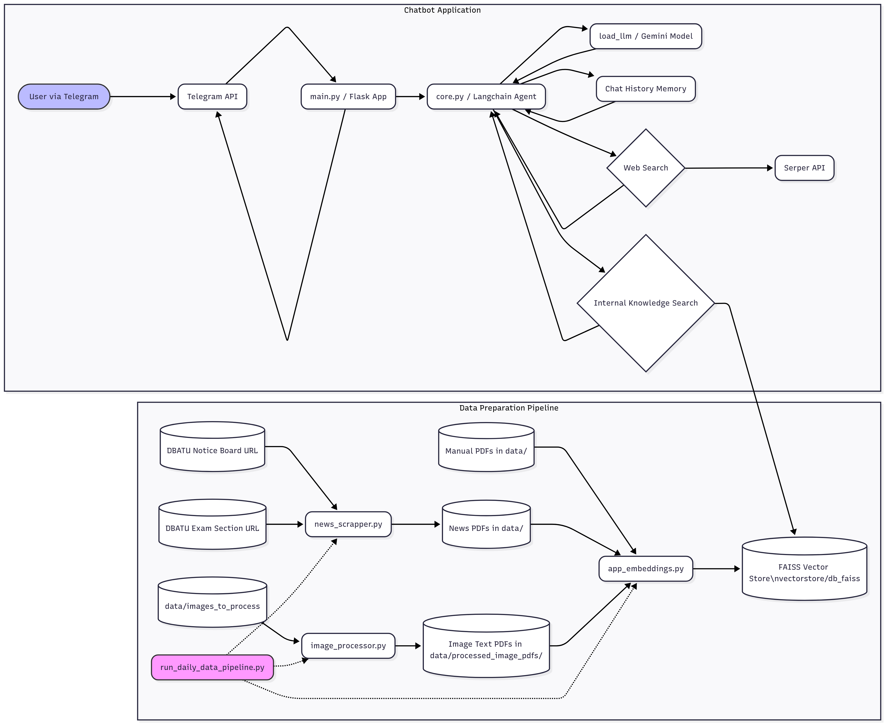

# Project Documentation: DBATU AI Assistant & Data Pipeline

## 1. Introduction

This project implements an AI-powered chatbot assistant for Dr. Babasaheb Ambedkar Technological University (DBATU). The assistant is designed to answer user queries related to the university by leveraging a knowledge base built from university documents and up-to-date news. The system includes a data pipeline for scraping news, processing images into text, and generating text embeddings to keep the chatbot's knowledge base current. The chatbot is accessible via a Telegram interface.

## 2. System Architecture Overview

The system can be broadly divided into two main parts:

1.  **Data Preparation Pipeline:** This set of scripts is responsible for gathering information from various sources (university website for news, local PDF documents, images containing text), processing this information, and converting it into a searchable vector database (FAISS). This pipeline is designed to be run periodically to ensure the knowledge base is up-to-date.
    *   `news_scrapper.py`: Fetches latest news/notices from specific DBATU web pages and saves them as PDFs.
    *   `image_processor.py`: Extracts text from images using OCR (Tesseract) and saves the extracted text as PDFs.
    *   `app_embeddings.py`: Loads all PDF documents (from news, image processing, and other manually added university documents) from a designated data directory, splits the text, generates embeddings using Google's Generative AI, and stores them in a FAISS vector database.
    *   `run_daily_data_pipeline.py`: Orchestrates the execution of the above scripts in sequence.

2.  **Chatbot Application & Interface:** This part handles user interaction, query processing, and interfacing with the AI model.
    *   `core.py`: Contains the core logic for the Langchain ReAct agent, including defining tools (internal knowledge search via FAISS, web search via Serper API), managing chat history, and prompting the Google Generative AI model (`gemini-2.0-flash-lite`).
    *   `main.py`: A Flask web application that serves as the backend for a Telegram bot. It receives messages from Telegram, passes questions to the chatbot core, and sends the generated answers back to the user via the Telegram API.

The overall workflow involves users interacting with the Telegram bot. Messages are routed through `main.py` to `core.py`, where the Langchain agent decides whether to use its internal knowledge (FAISS vector store created by `app_embeddings.py`) or a web search to answer the query.

### 2.1 The ReAct Framework: Powering the Agent's Decisions

A key component of the chatbot's intelligence in `core.py` is its use of the **ReAct (Reasoning and Acting)** framework. ReAct is a paradigm that enables Large Language Models (LLMs) to solve complex tasks by combining step-by-step reasoning with the ability to take actions (i.e., use tools).

**How ReAct Works:**

Instead of just generating a direct answer, a ReAct agent operates in a loop, iteratively performing the following steps:

1.  **Thought:** The LLM first reasons about the user's query and the current state of the conversation. It decides what information is needed, whether a tool should be used, or if it has enough information to answer.
2.  **Action:** If the LLM decides a tool is necessary, it specifies which tool to use (e.g., `DBATUInternalKnowledgeSearch` or `WebSearch`).
3.  **Action Input:** The LLM determines the appropriate input to provide to the chosen tool.
4.  **Observation:** The system executes the tool with the given input, and the result (output from the tool) is returned to the LLM as an "observation."

This "Thought -> Action -> Action Input -> Observation" cycle can repeat multiple times. The LLM uses the observations from tool executions to refine its reasoning and decide on subsequent steps.

**Concluding the Task:**

Once the LLM believes it has gathered enough information or has completed the necessary steps, it will output:

*   **Thought:** A final thought process summarizing its findings or decision.
*   **Final Answer:** The actual response to be delivered to the user.

**Importance in This Project:**

*   **Tool Usage:** ReAct allows the agent in `core.py` (created using `create_react_agent`) to dynamically choose between searching its internal FAISS knowledge base or performing a web search, based on the query.
*   **Structured Reasoning:** It provides a more transparent and controllable way for the LLM to arrive at an answer, as its reasoning steps can be (and are, with `verbose=True`) logged.
*   **Output Formatting (Rule #9):** The `dbatu_persona_and_rules` (specifically Rule #9: CRITICAL ReAct Output Format) provided to the LLM is vital. It strictly instructs the LLM to adhere to this "Thought, Action, Action Input, Observation, Final Answer" structure. Without this explicit guidance, LLMs might try to answer directly without the structured ReAct format, leading to parsing errors within the Langchain framework, as the `AgentExecutor` expects this specific output.

The ReAct framework, therefore, transforms the LLM from a simple text generator into a more capable agent that can reason about tasks and utilize tools to find and synthesize information effectively.

## 3. System Workflow Diagram (Mermaid.js Prompt)


**Explanation of Diagram Elements:**

*   **Data Preparation Pipeline:** Shows how news and image data are scraped/processed into PDFs, which along with manual PDFs, are fed into `app_embeddings.py` to create/update the FAISS vector store. `run_daily_data_pipeline.py` automates this.
*   **Chatbot Application:** Illustrates a user interacting via Telegram. The Flask app (`main.py`) receives the message and passes it to the `core.py` agent. The agent uses the LLM, chat history, and tools (which can access the FAISS DB or external Serper API) to generate a response.

## 4. Component Deep Dive

This section provides a detailed explanation of each Python script in the project.

### 4.1 `core.py` - Chatbot Agent Core Logic

*   **File Purpose:** This script is the heart of the AI assistant. It defines and configures the Langchain ReAct agent responsible for understanding user queries, interacting with tools, and generating responses using Google's Generative AI models.

*   **Key Components & Logic:**
    *   **Environment Variable Setup:** Loads `API_KEY` (for Google Generative AI) and `SERPER_API_KEY` (for web search) from a `.env` file.
    *   **`CHAT_HISTORY_MEMORY`:** A global `ConversationBufferMemory` instance to store and manage chat history across user interactions within a session. This allows the agent to have contextual conversations.
    *   **`load_llm()`:** Initializes and returns a `ChatGoogleGenerativeAI` instance, configured with the `gemini-2.0-flash-lite` model and a specific temperature.
    *   **Tool Definitions:**
        *   **`search_dbatu_documents(query)` (DBATUInternalKnowledgeSearch Tool):**
            *   Loads a FAISS vector database from `vectorstore/db_faiss` using `GoogleGenerativeAIEmbeddings`.
            *   Performs a similarity search (retrieval) on the loaded database based on the user's query.
            *   Returns the content of relevant documents found.
            *   Includes error handling for cases where the database is not found or empty.
        *   **`GoogleSerperAPIWrapper` (WebSearch Tool):**
            *   If `SERPER_API_KEY` is available, this tool is configured to perform web searches using Google Serper API.
            *   It's intended as a fallback if the internal knowledge search doesn't suffice for DBATU-related questions.
    *   **`dbatu_persona_and_rules`:** A long string defining the detailed persona, operational rules, and output formatting guidelines for the AI agent. This is crucial for controlling the agent's behavior, tone, tool usage priority, and response structure (especially the CRITICAL ReAct Output Format rule).
    *   **`create_dbatu_agent_executor()`:**
        *   Loads the LLM.
        *   Initializes the tools (DBATUInternalKnowledgeSearch, WebSearch).
        *   **Prompt Engineering:**
            *   Attempts to pull the `"hwchase17/react-chat"` prompt from Langchain Hub.
            *   Customizes the system message of this pulled prompt with `dbatu_persona_and_rules`.
            *   Includes robust fallback logic: if pulling or customizing the hub prompt fails, it constructs a `PromptTemplate` from a fallback template string (which also incorporates `dbatu_persona_and_rules` and ReAct formatting instructions).
        *   Uses `create_react_agent()` to create the agent instance with the LLM, tools, and the configured prompt.
        *   Wraps the agent in an `AgentExecutor`, providing it with the agent, tools, global chat history memory (`CHAT_HISTORY_MEMORY`), and parameters like `verbose=True`, `handle_parsing_errors`, and `max_iterations`.
    *   **`DBATU_AGENT_EXECUTOR` & `get_agent_executor()`:** Manages a global instance of the `AgentExecutor` to ensure persistence of memory and state across multiple calls within the same script run (important for `main.py`).
    *   **`user_input(user_question)`:**
        *   This is the main entry point for the chatbot logic.
        *   It retrieves the global `agent_executor`.
        *   Invokes the agent with the `user_question`. The `AgentExecutor` automatically handles history and tool interactions.
        *   Returns the agent's final answer and the current chat history.
        *   Includes error handling for agent execution.
    *   **Example Usage (`if __name__ == '__main__':`)**: Provides a command-line interface for interactive testing of the chatbot.

*   **Core Libraries Used:**
    *   `langchain`: For the agent framework (`AgentExecutor`, `create_react_agent`), LLM integration (`ChatGoogleGenerativeAI`), vector store interactions (`FAISS`), document loading/embedding (`GoogleGenerativeAIEmbeddings`), prompt templating (`ChatPromptTemplate`, `PromptTemplate`, `MessagesPlaceholder`), memory (`ConversationBufferMemory`), and tools (`Tool`).
    *   `langchain_google_genai`: Specific integration for Google's Generative AI models and embeddings.
    *   `langchain_community`: For community-provided components like `FAISS` vector store and `GoogleSerperAPIWrapper`.
    *   `dotenv`: For loading environment variables.
    *   `os`: For path operations.

*   **Interactions:**
    *   **Input:** Receives user questions via the `user_input` function.
    *   **Output:** Returns a dictionary containing the chatbot's textual answer and the chat history.
    *   **External Services:**
        *   Google Generative AI (for LLM responses and embeddings).
        *   Google Serper API (for web searches, if enabled).
    *   **Local Filesystem:**
        *   Reads API keys from `.env`.
        *   Loads the FAISS vector database from `vectorstore/db_faiss/`.
    *   **Called by:** `main.py` to process user requests from Telegram.

### 4.2 `main.py` - Flask Web Server & Telegram Bot Interface

*   **File Purpose:** This script sets up a Flask web application that acts as a webhook for a Telegram bot. It handles incoming messages from Telegram, processes them (text or voice), gets answers from `core.py`, and sends responses back to the Telegram user.

*   **Key Components & Logic:**
    *   **Flask App Initialization:** Creates a Flask app instance.
    *   **Environment Variable Loading:** Loads `API_KEY` (for Google GenAI, though `core.py` handles its direct use) and `TELEGRAM_BOT_TOKEN`.
    *   **`generate_answer(question)`:** A wrapper function that calls `user_input(question)['output_text']` from `core.py` to get the chatbot's answer.
    *   **`message_parser(message)`:**
        *   Parses the JSON message received from Telegram.
        *   Extracts `chat_id` and the content (`text` for text messages, `file_id` for voice messages).
        *   Identifies the message type ('text' or 'voice').
        *   Includes basic error handling for `KeyError`.
    *   **`send_message_telegram(chat_id, text)`:**
        *   Constructs a request to the Telegram Bot API's `sendMessage` endpoint.
        *   Sends the chatbot's textual answer back to the specified `chat_id`.
    *   **`index()` route (`'/'`, methods `GET`, `POST`):**
        *   This is the main webhook endpoint for Telegram.
        *   If `POST` request:
            *   Gets the JSON payload (Telegram message).
            *   Parses the message using `message_parser`.
            *   If it's a text message, calls `generate_answer` to get a response from `core.py`.
            *   If it's a voice message, it currently returns a placeholder "Sorry, I couldn't understand the audio message." (Voice processing is not fully implemented here, though `google.generativeai` is imported, suggesting potential future use).
            *   Sends the answer back to the user via `send_message_telegram`.
            *   Returns an 'ok' HTTP 200 response to Telegram.
        *   If `GET` request: Returns a simple HTML "Something went wrong" message (typically, Telegram uses POST for webhooks).
    *   **`if __name__ == '__main__':`**: Runs the Flask development server, making it accessible on `0.0.0.0:5000`.

*   **Core Libraries Used:**
    *   `flask`: For creating the web application and handling HTTP requests.
    *   `requests`: For making HTTP POST requests to the Telegram Bot API.
    *   `dotenv`: For loading environment variables.
    *   `os`: For accessing environment variables.
    *   `core` (custom module): Imports `user_input` to interact with the chatbot logic.
    *   `google.generativeai` (imported but not directly used for voice in the provided `index` logic, might be for other planned features).

*   **Interactions:**
    *   **Input:** Receives HTTP POST requests from the Telegram API whenever a user sends a message to the bot.
    *   **Output:** Sends HTTP POST requests to the Telegram API to deliver the chatbot's responses to the user. Returns HTTP 200 to Telegram to acknowledge message receipt.
    *   **External Services:**
        *   Telegram Bot API (for receiving messages and sending replies).
    *   **Internal Modules:**
        *   Calls `core.user_input()` to get chatbot responses.
    *   **Environment:** Reads `TELEGRAM_BOT_TOKEN` and `API_KEY`.

### 4.3 `news_scrapper.py` - News Fetching and PDF Creation

*   **File Purpose:** This script is responsible for scraping the latest news and notices from specified DBATU website URLs and compiling this information into a PDF document.

*   **Key Components & Logic:**
    *   **`get_latest_news(url)`:**
        *   Takes a URL as input.
        *   Uses the `requests` library to fetch the HTML content of the page.
        *   Parses the HTML using `BeautifulSoup`.
        *   Finds news articles by looking for `<article>` tags with specific CSS classes (`exad-post-grid-three exad-col`).
        *   For each of the first 5 articles found, it extracts the title, link, and date.
        *   Returns a list of dictionaries, where each dictionary represents a news item.
    *   **`create_pdf(news_list_1, news_list_2, filename)`:**
        *   Takes two lists of news items (presumably from two different URLs) and an output filename.
        *   Uses the `FPDF` library (from `fpdf2`) to create a new PDF document.
        *   Adds a title for each news list section.
        *   Iterates through each news item in both lists and writes the title, link, and date to the PDF.
        *   Saves the generated PDF to the `data/` directory.
    *   **`main()` function:**
        *   Defines two DBATU URLs: one for the "Students Notice Board" and one for the "Exam Section."
        *   Specifies the output PDF filename (`latest_news.pdf`).
        *   Checks if an old `latest_news.pdf` exists in `data/` and removes it to ensure a fresh file.
        *   Calls `get_latest_news()` for both URLs to fetch news.
        *   Calls `create_pdf()` to combine the fetched news into `data/latest_news.pdf`.

*   **Core Libraries Used:**
    *   `requests`: For making HTTP requests to fetch web page content.
    *   `beautifulsoup4` (`bs4`): For parsing HTML content and extracting data.
    *   `fpdf` (`FPDF` from `fpdf2`): For creating and writing PDF documents.
    *   `os`: For path operations (joining paths, checking file existence, removing files).

*   **Interactions:**
    *   **Input:** Reads from predefined DBATU website URLs.
    *   **Output:** Creates a PDF file (`latest_news.pdf`) in the `data/` directory containing the scraped news.
    *   **External Services:** Accesses `dbatu.ac.in` website.
    *   **Called by:** `app_embeddings.py` (imports and calls `main()` from `news_scrapper`) and `run_daily_data_pipeline.py`.

### 4.4 `image_processor.py` - OCR Text Extraction from Images

*   **File Purpose:** This script extracts textual content from images using Tesseract OCR and saves the extracted text into individual PDF files.

*   **Key Components & Logic:**
    *   **Tesseract Configuration Note:** Includes comments on how to specify the Tesseract command path if it's not in the system PATH.
    *   **`extract_text_from_image(image_path)`:**
        *   Takes the path to an image file.
        *   Uses `pytesseract.image_to_string(Image.open(image_path))` to perform OCR.
        *   Includes error handling for `FileNotFoundError`, `pytesseract.TesseractNotFoundError` (critical), and other general exceptions during OCR.
    *   **`create_pdf_from_text(text_content, original_image_filename, output_pdf_path)`:**
        *   Takes the extracted text, the original image filename (for titling), and the desired output PDF path.
        *   Uses `FPDF` to create a PDF.
        *   Defaults to Arial font. Comments suggest an attempt to use DejaVu for better Unicode, but it's commented out.
        *   Encodes text to `latin-1` with replacements as a workaround for FPDF errors with unsupported characters if a non-Unicode font (like default Arial) is active. This can lead to loss of special characters.
        *   Writes the extracted text to the PDF.
        *   Saves the PDF to the specified `output_pdf_path`.
    *   **`process_images_in_directory(input_dir, output_dir)`:**
        *   Iterates through all files in the `input_dir` (default: `data/images_to_process`).
        *   Checks for supported image formats.
        *   For each supported image, calls `extract_text_from_image()` and then `create_pdf_from_text()`.
        *   Prints status messages and a summary.
    *   **`if __name__ == '__main__':` block:**
        *   Provides example usage and creates a dummy input directory if needed.
        *   Calls `process_images_in_directory()` with error handling for `TesseractNotFoundError`.

*   **Core Libraries Used:**
    *   `pytesseract`: Python wrapper for Tesseract OCR engine.
    *   `Pillow` (`PIL`): Used for opening and manipulating image files.
    *   `fpdf` (`FPDF` from `fpdf2`): For creating PDF documents from the extracted text.
    *   `os`: For directory and path manipulations.

*   **Interactions:**
    *   **Input:** Reads image files from `data/images_to_process/`.
    *   **Output:** Creates PDF files containing extracted text in `data/processed_image_pdfs/`.
    *   **External Dependencies:** Requires Tesseract OCR to be installed and accessible.
    *   **Called by:** `run_daily_data_pipeline.py`.

### 4.5 `app_embeddings.py` - Vector Database Creation

*   **File Purpose:** This script builds the knowledge base for the chatbot. It loads PDF documents, splits their text, generates text embeddings using Google Generative AI, and stores these in a FAISS vector database.

*   **Key Components & Logic:**
    *   **Initial News Scraping:** Imports and calls `main()` from `news_scrapper` to ensure `latest_news.pdf` is current.
    *   **Path Definitions:** `DATA_PATH` (default: `data/`) for input documents, `DB_FAISS_PATH` (default: `vectorstore/db_faiss`) for the vector store.
    *   **API Key Setup:** Loads and configures `GOOGLE_API_KEY`.
    *   **`create_vector_db()`:**
        *   **Document Loading:** Uses `DirectoryLoader` with `PyPDFLoader` to recursively load all PDFs from `DATA_PATH`.
        *   **Text Splitting:** Uses `RecursiveCharacterTextSplitter` (chunk size 512, overlap 64).
        *   **Embedding Model:** Initializes `GoogleGenerativeAIEmbeddings` (`"models/text-embedding-004"`).
        *   **Batch Processing & FAISS Storage:**
            *   Processes texts in batches (size 50).
            *   Embeds content using `embeddings.embed_documents()`.
            *   Creates a new FAISS store with `FAISS.from_texts()` for the first batch.
            *   Adds subsequent batches to the existing store using `db.add_texts()`.
            *   Includes `time.sleep(10)` between batches (likely for API rate limits).
        *   **Saving Database:** Saves the FAISS index locally via `db.save_local(DB_FAISS_PATH)`.
    *   **`if __name__ == "__main__":`**: Calls `create_vector_db()`.

*   **Core Libraries Used:**
    *   `langchain`: For text splitting, document loading, vector store operations, embedding models.
    *   `langchain_google_genai`: For Google Generative AI embeddings.
    *   `langchain_community`: For `FAISS` and `DirectoryLoader`.
    *   `google-generativeai` (`genai`): For API key configuration.
    *   `dotenv`: For environment variables.
    *   `os`: For path operations.
    *   `time`: For `time.sleep()`.
    *   `news_scrapper` (custom module): To run news scraping.

*   **Interactions:**
    *   **Input:**
        *   Reads PDFs from `DATA_PATH` (including those from `news_scrapper`, `image_processor`, and manual additions).
        *   Reads `GOOGLE_API_KEY`.
    *   **Output:** Creates/updates FAISS vector database at `DB_FAISS_PATH`.
    *   **External Services:** Google Generative AI (for text embeddings).
    *   **Internal Modules:** Calls `main()` from `news_scrapper.py`.
    *   **Called by:** `run_daily_data_pipeline.py`, or manually.

### 4.6 `run_daily_data_pipeline.py` - Pipeline Orchestration

*   **File Purpose:** Orchestrates the execution of `news_scrapper.py`, `image_processor.py`, and `app_embeddings.py` in sequence to update the data pipeline.

*   **Key Components & Logic:**
    *   **`run_script(script_name)`:**
        *   Helper function to execute Python scripts using `subprocess.Popen`.
        *   Captures and prints `stdout`/`stderr` in real-time.
        *   Reports success or failure of each script.
    *   **`main()` function:**
        *   **Pre-run Checks:** Notes Tesseract dependency for `image_processor.py` and creates `data/images_to_process` directory if absent.
        *   **Execution Steps:**
            1.  Runs `news_scrapper.py`.
            2.  Runs `image_processor.py`.
            3.  Runs `app_embeddings.py`.
        *   Logs warnings for non-critical failures but emphasizes failure in embedding generation as critical.
        *   Suggests automation via cron or Task Scheduler.
    *   **`if __name__ == "__main__":`**: Calls `main()`.

*   **Core Libraries Used:**
    *   `subprocess`: For running other scripts.
    *   `sys`: For `sys.executable`.
    *   `os`: For path manipulations.
    *   `datetime`: For timestamping logs.

*   **Interactions:**
    *   **Output:** Console logs detailing pipeline progress.
    *   **Internal Modules:** Executes `news_scrapper.py`, `image_processor.py`, `app_embeddings.py`.
    *   **Called by:** Manually or by a scheduler.

## 5. Data Pipeline Summary

The project includes a data pipeline orchestrated by `run_daily_data_pipeline.py`:

1.  **News Scraping (`news_scrapper.py`):** Fetches latest news from DBATU website URLs and saves as `data/latest_news.pdf`.
2.  **Image Processing (`image_processor.py`):** Extracts text from images in `data/images_to_process/` using Tesseract OCR, saving results as PDFs in `data/processed_image_pdfs/`.
3.  **Embedding Generation (`app_embeddings.py`):**
    *   Ensures `news_scrapper.py` has run.
    *   Loads all PDFs from `data/` (news, image text, manual documents).
    *   Splits text, generates embeddings (Google's text-embedding-004), and stores/updates the FAISS vector database at `vectorstore/db_faiss`.

This pipeline refreshes the chatbot's knowledge base and is designed for periodic execution.

## 6. Setup & Running the Application

1.  **Prerequisites:**
    *   Python 3.x.
    *   Tesseract OCR installed and in system PATH.
    *   Telegram Bot token.
2.  **Installation:**
    *   Clone repository.
    *   Install Python libraries (e.g., via `pip install -r requirements.txt` - assuming `requirements.txt` with `langchain`, `langchain-google-genai`, `langchain-community`, `flask`, `requests`, `python-dotenv`, `beautifulsoup4`, `fpdf2`, `pytesseract`, `Pillow`, `faiss-cpu`).
3.  **Environment Variables (`.env` file):**
    ```
    API_KEY="YOUR_GOOGLE_GENERATIVE_AI_API_KEY"
    SERPER_API_KEY="YOUR_GOOGLE_SERPER_API_KEY" 
    TELEGRAM_BOT_TOKEN="YOUR_TELEGRAM_BOT_TOKEN"
    ```
4.  **Initial Data Preparation:**
    *   Place university PDFs in `data/`.
    *   Place images for OCR in `data/images_to_process/`.
    *   Run `python app_embeddings.py` or `python run_daily_data_pipeline.py` once.
5.  **Running Chatbot (Flask Server for Telegram):**
    *   Run `python main.py`.
    *   Configure Telegram bot webhook to your server's public URL.
6.  **Running Data Pipeline Periodically:**
    *   Schedule `python run_daily_data_pipeline.py` (e.g., via cron).

## 7. Key Environment Variables

*   `API_KEY`: Google Generative AI API key (for LLM & embeddings). Used by `core.py`, `app_embeddings.py`.
*   `SERPER_API_KEY`: Google Serper API key (for web search). Used by `core.py`.
*   `TELEGRAM_BOT_TOKEN`: Telegram bot token. Used by `main.py`.
*   `DB_FAISS_PATH`: (Optional) Path to FAISS vector store. Default: `vectorstore/db_faiss`. Used by `core.py`, `app_embeddings.py`.
---